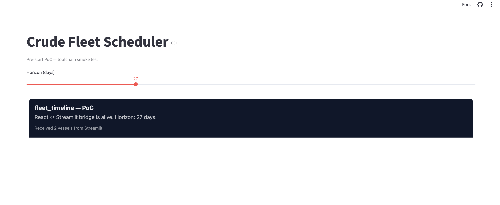

# Crude Fleet Scheduler

[](https://github.com/Denis-Joly/crude-fleet-scheduler/actions/workflows/ci.yml)
[](https://crude-fleet-scheduler.streamlit.app)
[](LICENSE)

MILP-based scheduler for crude oil tanker fleets (VLCC / Suezmax). Assigns cargoes to vessels over a 45-day horizon, minimizing charter cost, bunker fuel consumption, and demurrage exposure — with SOS2 linearization of the cubic fuel–speed relationship.

**Status:** pre-start scaffolding (Apr 20 – May 3, 2026). See [docs/overview.md](docs/overview.md) for the full project summary.

**Live demo:** [crude-fleet-scheduler.streamlit.app](https://crude-fleet-scheduler.streamlit.app) — pre-start placeholder; the real optimizer + D3/Mapbox time-slider ship Week 12.



*Pre-start proof-of-concept running on Streamlit Cloud: the custom React component (dark box) is mounted inside the Streamlit app and receiving slider state + vessel data from the Python side. This validates the entire Week 12 deployment pipeline — Vite-built bundle, committed `build/`, React ↔ Streamlit bridge — before any optimization code is written.*

## Highlights
- **SOS2 speed-fuel linearization** — same technique used in [pytfa](https://github.com/EPFL-LCSB/pytfa) for thermodynamic Gibbs-free-energy constraints, applied here to bunker fuel.
- **Open-source solver stack** — SCIP (native SOS2, Apache 2.0) via `pyscipopt` by default, HiGHS for fast non-SOS models, Gurobi supported as an optional performance benchmark. No commercial license required to run or deploy.
- **Hybrid dashboard** — Streamlit shell with a custom React + D3 + Mapbox time-slider component showing the optimized fleet animating across the horizon.
- **Production-quality data layer** — Pydantic-validated ingestion of MarineCadastre AIS, Equasis vessel specs, World Port Index ports.

## Quick start

```bash
pip install -e ".[dev]"          # primary deps, including SCIP via pyscipopt
# pip install -e ".[dev,gurobi]" # optional — adds gurobipy for benchmarking
pre-commit install
pytest

# run the app (release mode — serves the committed React bundle)
streamlit run streamlit_app.py

# pick a different solver at runtime:
CFS_SOLVER=highs streamlit run streamlit_app.py
```

### Working on the React component

```bash
cd app/components/fleet_timeline
npm install
npm run dev                     # Vite on :3001, hot reload

# in another terminal, from repo root:
FLEET_TIMELINE_DEV=1 streamlit run streamlit_app.py
```

Before pushing any change to the component, rebuild and commit the output:

```bash
cd app/components/fleet_timeline && npm run build
git add build/ && git commit -m "rebuild fleet_timeline bundle"
```

Streamlit Cloud has no Node runtime, so the committed `build/` directory is
what it serves.

## Out of scope
Real-time re-optimization, ML demand forecasting, FFA hedging, emissions compliance (CII/EU ETS), chartering strategy, product tankers / LNG / dry bulk.

## License
MIT
